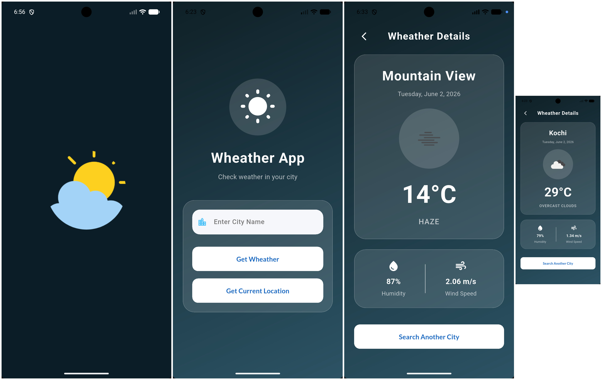
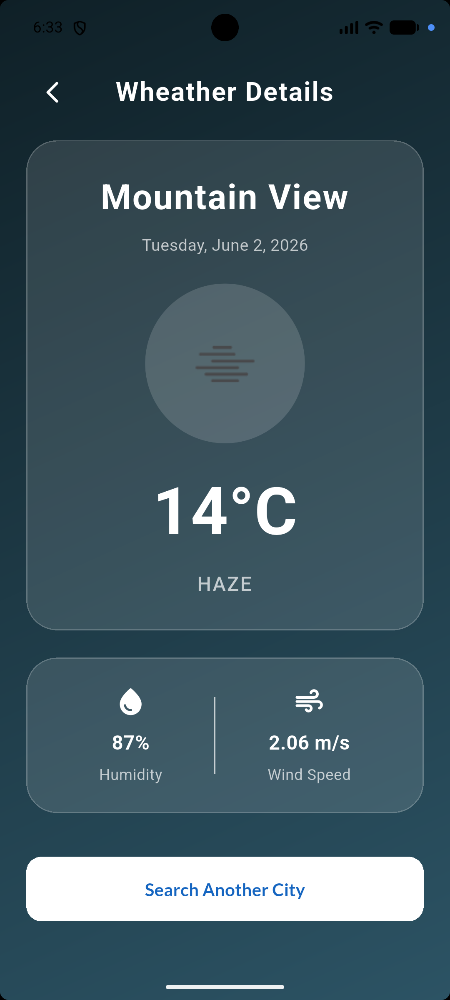
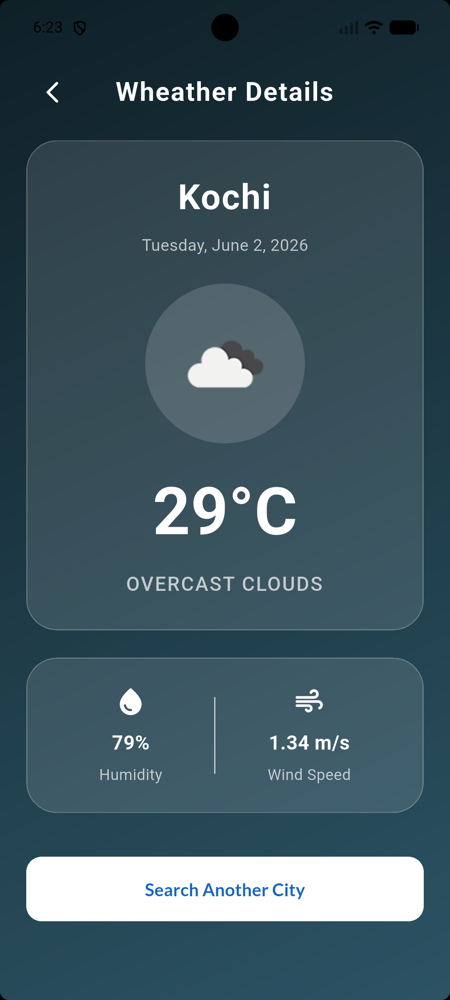

# Weather App

A Flutter-based weather application that provides real-time weather information using the OpenWeather API. The application automatically detects the user's current location and allows weather searches for any city worldwide.

## Features

* Current location weather detection
* Search weather by city name
* Temperature display in Celsius
* Weather condition information
* Responsive and user-friendly UI

## Tech Stack

* Flutter
* Dart
* OpenWeather API
* Geolocator
* HTTP Package

## Screenshots

### Home Screen




### Current Location Weather


### City Search Weather


## Project Structure

```text
     lib/ 
     ├── models/ 
     │   └── wheather_model.dart
     ├── screens/ 
     │   ├── intro_screen.dart 
     │   ├── location_page.dart 
     │   └── wheather_screen.dart 
     │ 
     ├── services/ 
     │   ├── location_services.dart 
     │   └── wheather_services.dart  
     ├── const.dart 
     ├── custom_dialog.dart 
     ├── elevated_style.dart 
     ├── humidity_column.dart 
     └── main.dart

## Installation

1. Clone the repository

```bash
git clone https://github.com/shiyascholayil/weather-app.git
```

2. Navigate to the project

```bash
cd weather-app
```

3. Install dependencies

```bash
flutter pub get
```

4. Run the application

```bash
flutter run
```

## API

This project uses the OpenWeather API to fetch real-time weather data.

## Future Enhancements

* Dark mode support
* Weather notifications
* Favorite locations

## Author

Shiyas Cholayil

GitHub: https://github.com/shiyascholayil
